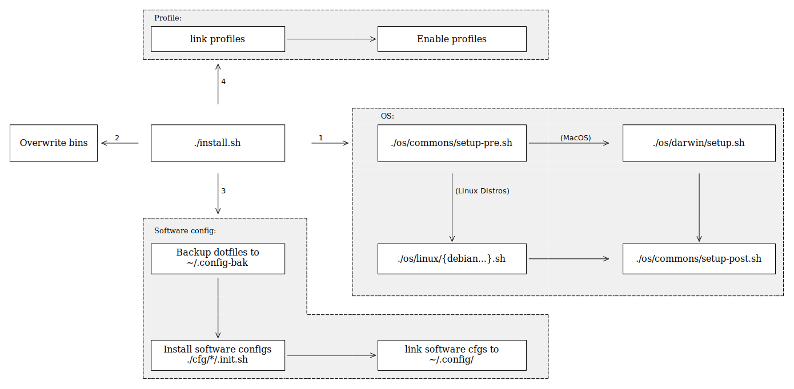

# dotfiles

```
.
├── bin           # Custom bin
├── cfg           # Software configs
├── os            # OS setup scripts
├── profiles.d    # Custom env, alias...
├── install.sh    # OS Init, Software Install...
├── flow.graph    # Graph:Easy flow
├── flow.svg      # SVG generated based on flow.graph
├── gen_flow.sh   # Install Graph:Easy & generate flow.svg
└── README.md

4 directories, 2 files
```

## Introduction




## Usage

1. Manually back up all configurations: `$XDG_CONFIG_HOME` or `~/.config/`
2. **Read the code**: `install.sh`, `./os/setup.sh`, `./os/{commons, darwin, linux}/setup.sh`
3. Modify to your own configuration
   - Softwares: `./os/{commons, darwin, linux}/setup.sh`: **Softwares** Section
   - Software Configs: `./cfg/{software name}/`
4. Run `./install.sh`
